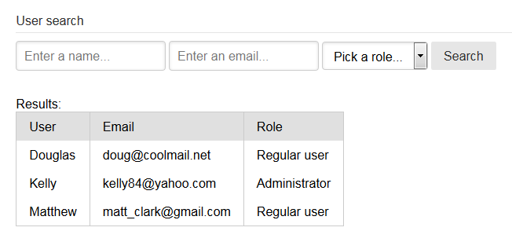

<p align="center">
    <a href="#query">
        
    </a>
</p>

# Query

[![][build-img]][build]
[![][nuget-img]][nuget]

[build]:     https://ci.appveyor.com/project/TallesL/net-Query
[build-img]: https://ci.appveyor.com/api/projects/status/github/tallesl/net-Query?svg=true
[nuget]:     https://www.nuget.org/packages/Query/
[nuget-img]: https://badge.fury.io/nu/Query.svg

A simplistic ADO.NET wrapper.

* [Instantiating](#instantiating)
* [Modifying data](#modifying-data)
* [Retrieving data](#retrieving-data)
* [Behind the covers](#behind-the-covers)
* [Thread safety](#thread-safety)
* [Connections and Transactions](#connections-and-transactions)
* [IN clauses](#in-clauses)
* [SELECT clauses](#select-clauses)

## Instantiating

```cs
var query = new Query("Data Source=server; Initial Catalog=database; User ID=user; Password=password;", "System.Data.SqlClient");
```

There's some optional arguments besides the query string and the provider name:

* `enumAsString`: Treat enum values as strings rather than as integers;
* `manualClosing`: Connection/transaction closing should be done 'manually' instead of automatically on each call (see
["Connections and Transactions"](#connections-and-transactions));
* `safe`: Throws if a selected property is not found in the given type;
* `commandTimeout`: Optional [DBCommand.CommandTimeout](https://msdn.microsoft.com/library/System.Data.Common.DBCommand.CommandTimeout) value.

## Modifying data

```cs
query.Change("DELETE FROM Users WHERE Name LIKE @NameToDelete", new { NameToDelete = "John" });
```

You can also make sure how many rows will be affected with:

* `ChangeExactly(n, sql, parameters)`
* `ChangeNoLessThan(n, sql, parameters)`
* `ChangeNoMoreThan(n, sql, parameters)`

`UnexpectedNumberOfRowsAffectedException` is thrown and the transaction is rolled back if the amount of affected rows is
different from the expected.

## Retrieving data

```cs
int count = query.SelectSingle<int>("SELECT COUNT(0) FROM Users");

DataTable dataTable = query.Select("SELECT * FROM Users");

IEnumerable<User> users = query.Select<User>("SELECT * FROM Users");
User user = query.SelectExactlyOne<User>("SELECT * FROM Users WHERE Id = @Id", new { Id = 1337 });
```

You can also make sure how many rows will be selected with:

* `SelectExactly(n, sql, parameters)`
* `SelectNoLessThan(n, sql, parameters)`
* `SelectNoMoreThan(n, sql, parameters)`

`UnexpectedNumberOfRowsSelectedException` is thrown if the amount of selected rows is different from the expected.

## Behind the covers

`Change` uses [SqlCommand.ExecuteNonQuery](https://msdn.microsoft.com/library/System.Data.SqlClient.SqlCommand.ExecuteNonQuery),
`Select` uses [DbDataAdapter.Fill](https://msdn.microsoft.com/library/System.Data.Common.DbDataAdapter.Fill)
(except `SelectSingle`, which uses [SqlCommand.ExecuteScalar](https://msdn.microsoft.com/library/System.Data.SqlClient.SqlCommand.ExecuteScalar)).

## Thread safety

The library isn't thread safe, but it should be lightweight enough to be instantiated as needed during the lifetime of
your application (such as one per request).

## Connections and Transactions

The library opens a connection (and a transaction for writes) and closes it for every operation.
There's no need to call [Dispose](https://msdn.microsoft.com/library/System.IDisposable.Dispose).

```cs
var query = new Query("connection string", "provider name"); // false is the default for manualClosing

// opens and closes a connection and a transaction
query.Change("INSERT INTO Foo VALUES ('Bar')");

// opens and closes a connection (again)
// 'Foo' will have 'Bar' in the database, despite the exception here
query.Change("some syntax error");
```

However, if `manualClosing` is set to `True`, it automatically opens the connection and transaction and reuses it for
each consecutive command.
The open connection and (and transaction) are closed/committed when you call `Close()`.

```cs
var query = new Query("connection string", "provider name", manualClosing: true);

// opens a connection and a transaction
query.Change("INSERT INTO Foo VALUES ('Bar')");

// reuses the connection (and transaction) opened above
// 'Foo' won't have 'Bar' in the database, the exception here rollbacks the transaction
query.Change("some syntax error");

// commits the transaction and closes the connection
// (won't reach here in this particular example because the line above raised an exception and rolled back)
query.Close();
```

If you don't plan to reuse the object elsewhere, you may shield its usage with `using`:

```cs
// this is equivalent to the example above
using (var query = new Query("connection string", "provider name", manualClosing: true))
{
    query.Change("INSERT INTO Foo VALUES ('Bar')");
    query.Change("some syntax error");
}
```

## IN clauses

The library automatically prepares collections ([IEnumerable](https://msdn.microsoft.com/library/System.Collections.IEnumerable))
for [IN](https://msdn.microsoft.com/library/ms177682) clauses
([taking that burden off you](http://stackoverflow.com/q/337704/1316620)).

This:

```cs
query.Change("DELETE FROM Users WHERE Id IN (@Ids)", new { Ids = new[] { 1, 123, 44 } });
```

Becomes this:

```sql
DELETE FROM Users WHERE Id IN (@Ids0, @Ids1, @Ids2)
```

## SELECT clauses

Running handmade SQL queries instead of fighting an ORM to find out what it's generating is one of the reasons to use a
*micro ORM*.

It's all fun and games until you have to build a more complex query, one that can take multiple forms accordingly to
some set of parameters.

Those are usually `SELECT` queries in which the `WHERE` clause can take different combinations of parameters (or even be
abscent).

To aid in such scenarios, there is a built-in `Select` type that you can instantiate it like
`new Select("ColumnA", "ColumnB", "ColumnC", ...)` and then, on the constructed object, you're able to call:

* `From`
* `Join`
* `LeftOuterJoin`
* `RightOuterJoin`
* `FullOuterJoin`
* `CrossJoin`
* `Where`
* `WhereAnd`
* `WhereOr`
* `GroupBy`
* `Having`
* `OrderBy`

A `ToString` call gives you the resulting SQL (but the object implicitly casts to string if needed).

To illustrate, such page:



Could be powered by the following code:

```cs
public class Role
{
    public int Id { get; set; }

    public string Name { get; set; }
}

public class User
{
    public int Id { get; set; }

    public string Name { get; set; }

    public string Email { get; set; }

    // this property requires a JOIN when querying the database
    public Role Role { get; set; }
}

// it's often useful to expose the Query object through a property
Query Query
{
    get => new Query("connection string", "provider name");
}

// it's also useful to create a property with a 'vanilla' SELECT of an entity of yours (DRY)
Select UserSelect
{
    get => new Select(
        // the names of the selected columns and the class properties must match
        "User.Id",
        "User.Name",
        "User.Email",

        // it can work out the whole property tree, in other words, it can go more than one level deeper
        // (PropertyA.PropertyAB.PropertyABC.PropertyABCD...)
        "Role.Id AS 'Role.Id'",
        "Role.Name AS 'Role.Name'")
        .From("User")
        .Join("Role", "RoleId = Role.Id");
}

// a search method in which all the parameters are optional
IEnumerable<User> Search(string name, string email, int? role)
{
    var select = UserSelect;

    // using a ExpandoObject as parameters helps when dealing with optional conditions
    dynamic parameters = new ExpandoObject();

    if (!string.IsNullOrWhiteSpace(name))
    {
        select.WhereAnd("User.Name LIKE %@Name%");
        parameters.Name = name;
    }

    if (!string.IsNullOrWhiteSpace(email))
    {
        select.WhereAnd("User.Email LIKE %@Email%");
        parameters.Email = email;
    }

    if (role.HasValue)
    {
        select.WhereAnd("User.RoleId = @RoleId");
        parameters.Role = role;
    }

    return Query.Select<User>(select, parameters);
}
```